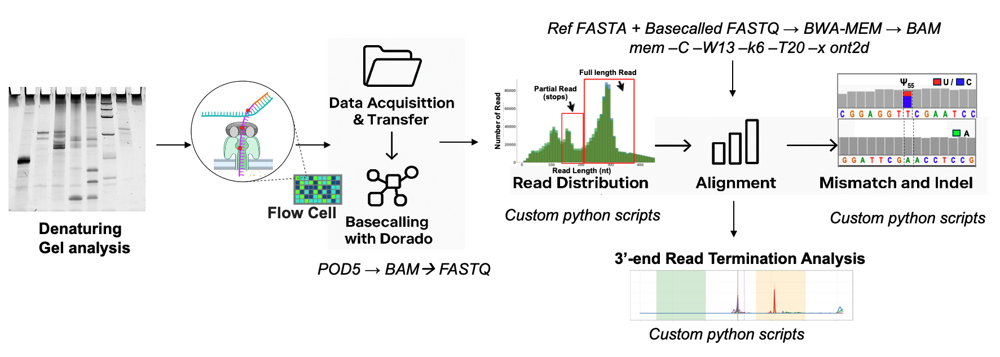

# Oxford Nanopore 2-Read Genome Wide tRNA Modification Analysis Pipeline

## Overview

This repository showcases a **bioinformatics pipeline for detecting 2-Read tRNA modifications** using Oxford Nanopore sequencing technology. The approach leverages basecalling error signatures and read termination patterns to identify epitranscriptomic modifications at single-nucleotide "per-read" "per-site" resolution.

**Key Innovation**: Detection of RNA modifications through analysis of  systematic ONT basecalling errors, polymerase read-through+error and termination events during nanopore sequencing.

## Research Collaboration

This work represents ongoing research in **epitranscriptomic analysis** using cutting-edge Oxford Nanopore sequencing technology. 

**For more information about this research:**
- **Principal Investigator**: [Dr. Hou Lab](https://www.jefferson.edu/academics/colleges-schools-institutes/skmc/departments/biochemistry/faculty/hou.html)
- **Institution**: Thomas Jefferson University, Department of Biochemistry
- **Contact**: For collaboration opportunities and detailed methodologies

## Research Approach

### Methodology
- **Direct RNA Sequencing**: Oxford Nanopore direct RNA sequencing of tRNA molecules
- **Error Signature Analysis**: Custom algorithms to identify modification-induced basecalling errors
- **Termination Pattern Detection**: Analysis of polymerase stop sites indicating modified bases
- **High-Resolution Mapping**: Single-nucleotide resolution modification detection

### Experimental Design
- **Sample Types**: E. coli, Human, and Yeast tRNA molecules
- **Controls**: Comparative analysis with known modification sites
- **Validation**: Cross-validation with established modification detection methods

## Pipeline Overview

### Key Pipeline Steps

#### 1. Sample Preparation & Sequencing
- **Library Preparation**: Developed 2-Read RNA library preparation via polymerase
- **Sequencing**: MinION/PromethION sequencing with real-time basecalling

#### 2. Data Processing
- **Basecalling**: Dorado basecaller with modification-aware models
- **Format Conversion**: POD5 → BAM → FASTQ workflow
- **Quality Control**: Read length distribution and quality metrics analysis

#### 3. Alignment & Analysis
- **Reference Alignment**: BWA-MEM alignment to tRNA reference sequences
- **Custom Analysis**: Python scripts for mismatch and indel pattern analysis
- **Termination Analysis**: 5'+ 3'-end read termination pattern detection

#### 4. Modification Detection
- **Error Pattern Analysis**: Systematic identification of modification signatures
- **Statistical Validation**: Confidence scoring for detected modifications
- **Visualization**: Custom plotting for modification landscape analysis

## Technical Highlights

### Bioinformatics Innovation
- **Custom Python Scripts**: Specialized algorithms for RNA modification detection
- **Error Signature Profiling**: Novel approach to identify modification-induced errors
- **Termination Site Analysis**: Polymerase stop site detection algorithms
- **Statistical Framework**: Robust statistical methods for modification calling

## Applications & Impact

### Research Applications
- **Epitranscriptomics**: Genome-wide RNA modification mapping
- **tRNA Biology**: Understanding tRNA modification patterns
- **Disease Research**: Modification changes in disease states
- **Comparative Analysis**: Cross-species modification studies

## Acknowledgments

This research was conducted in collaboration with experts in epitranscriptomics and nanopore sequencing technology. The work represents innovative applications of Oxford Nanopore technology for RNA modification detection.
